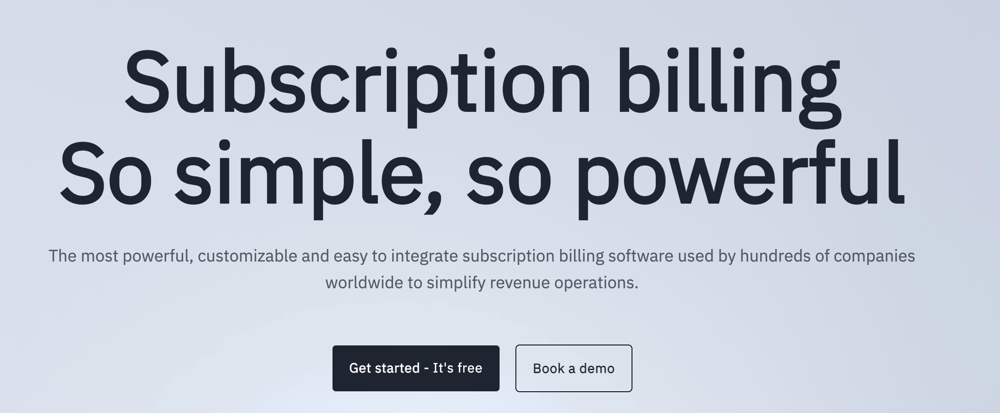

<div align="left">

[](https://www.billsby.com&#x2F;)

# Billsby<a id="billsby"></a>

Billsby is a feature-rich \"Saas\" recurring payment platform, ranked as the leading subscription billing software by G2.

Billsby is designed to ensure customers can go live quickly, often within 1-2 hours.  To help facilitate this process we have a team of friendly knowledgeable advisors ready to help your business go live.    

Billsby specializes in providing great customer service at an affordable price point - our technology is rated No 1 on G2 by our customers.

If you are a developer creating a solution for your customer, Billsby has a friendly well-documented API.  The Billsby team are here to provide support to developers in order to ensure a smooth migration or new system build. 

Why not book a call, talk through your Billing requirements and we can let you know how we can help you transform your business..


</div>

## Table of Contents<a id="table-of-contents"></a>

<!-- toc -->

- [Requirements](#requirements)
- [Installation](#installation)
- [Getting Started](#getting-started)
- [Async](#async)
- [Raw HTTP Response](#raw-http-response)
- [Reference](#reference)
  * [`billsby.addon.get_addon_list`](#billsbyaddonget_addon_list)
  * [`billsby.addon.get_details`](#billsbyaddonget_details)
  * [`billsby.addon.list_available_addons`](#billsbyaddonlist_available_addons)
  * [`billsby.allowance.get_details`](#billsbyallowanceget_details)
  * [`billsby.allowance.get_list`](#billsbyallowanceget_list)
  * [`billsby.allowance.get_specific_subscription_allowances`](#billsbyallowanceget_specific_subscription_allowances)
  * [`billsby.creditnote.list`](#billsbycreditnotelist)
  * [`billsby.creditnote.reattempt_payment`](#billsbycreditnotereattempt_payment)
  * [`billsby.custom_field.create_new_field`](#billsbycustom_fieldcreate_new_field)
  * [`billsby.custom_field.get_response`](#billsbycustom_fieldget_response)
  * [`billsby.custom_field.list`](#billsbycustom_fieldlist)
  * [`billsby.custom_field.update_field`](#billsbycustom_fieldupdate_field)
  * [`billsby.customer.add_subscription_to_existing_customer`](#billsbycustomeradd_subscription_to_existing_customer)
  * [`billsby.customer.clear_gdpr_data`](#billsbycustomerclear_gdpr_data)
  * [`billsby.customer.create_new_customer_and_subscription`](#billsbycustomercreate_new_customer_and_subscription)
  * [`billsby.customer.create_without_subscription`](#billsbycustomercreate_without_subscription)
  * [`billsby.customer.delete_by_id`](#billsbycustomerdelete_by_id)
  * [`billsby.customer.get_credit_notes`](#billsbycustomerget_credit_notes)
  * [`billsby.customer.get_details`](#billsbycustomerget_details)
  * [`billsby.customer.get_feature_tags`](#billsbycustomerget_feature_tags)
  * [`billsby.customer.get_subscriptions_by_unique_id`](#billsbycustomerget_subscriptions_by_unique_id)
  * [`billsby.customer.list_customers`](#billsbycustomerlist_customers)
  * [`billsby.customer.update_custom_field_response`](#billsbycustomerupdate_custom_field_response)
  * [`billsby.customer.update_details`](#billsbycustomerupdate_details)
  * [`billsby.customer.update_payment_card_token`](#billsbycustomerupdate_payment_card_token)
  * [`billsby.customer.update_payment_details_request`](#billsbycustomerupdate_payment_details_request)
  * [`billsby.invoice.create_one_time_charge`](#billsbyinvoicecreate_one_time_charge)
  * [`billsby.invoice.create_refund`](#billsbyinvoicecreate_refund)
  * [`billsby.invoice.details`](#billsbyinvoicedetails)
  * [`billsby.invoice.get_customer_invoices`](#billsbyinvoiceget_customer_invoices)
  * [`billsby.invoice.get_payment_logs`](#billsbyinvoiceget_payment_logs)
  * [`billsby.invoice.list_company_invoices`](#billsbyinvoicelist_company_invoices)
  * [`billsby.invoice.mark_as_paid_offline`](#billsbyinvoicemark_as_paid_offline)
  * [`billsby.invoice.mark_written_off`](#billsbyinvoicemark_written_off)
  * [`billsby.invoice.reattempt_payment`](#billsbyinvoicereattempt_payment)
  * [`billsby.product.create_cycle`](#billsbyproductcreate_cycle)
  * [`billsby.product.create_new_product`](#billsbyproductcreate_new_product)
  * [`billsby.product.create_plan`](#billsbyproductcreate_plan)
  * [`billsby.product.get_details`](#billsbyproductget_details)
  * [`billsby.product.list_plans`](#billsbyproductlist_plans)
  * [`billsby.product.list_products`](#billsbyproductlist_products)
  * [`billsby.product.update_plan_and_cycle`](#billsbyproductupdate_plan_and_cycle)
  * [`billsby.product.update_plan_order`](#billsbyproductupdate_plan_order)
  * [`billsby.product.update_product`](#billsbyproductupdate_product)
  * [`billsby.subscription.add_feature_tags`](#billsbysubscriptionadd_feature_tags)
  * [`billsby.subscription.cancel_subscription`](#billsbysubscriptioncancel_subscription)
  * [`billsby.subscription.change_plan`](#billsbysubscriptionchange_plan)
  * [`billsby.subscription.feature_tags_split`](#billsbysubscriptionfeature_tags_split)
  * [`billsby.subscription.get_counters_value`](#billsbysubscriptionget_counters_value)
  * [`billsby.subscription.get_details`](#billsbysubscriptionget_details)
  * [`billsby.subscription.get_event_logs`](#billsbysubscriptionget_event_logs)
  * [`billsby.subscription.get_shipping_address`](#billsbysubscriptionget_shipping_address)
  * [`billsby.subscription.list_subscriptions`](#billsbysubscriptionlist_subscriptions)
  * [`billsby.subscription.list_tags_by_subscription`](#billsbysubscriptionlist_tags_by_subscription)
  * [`billsby.subscription.remove_feature_tag`](#billsbysubscriptionremove_feature_tag)
  * [`billsby.subscription.update_counter`](#billsbysubscriptionupdate_counter)
  * [`billsby.subscription.update_renewal_date`](#billsbysubscriptionupdate_renewal_date)
  * [`billsby.subscription.update_shipping_address`](#billsbysubscriptionupdate_shipping_address)

<!-- tocstop -->

## Requirements<a id="requirements"></a>

Python >=3.7

## Installation<a id="installation"></a>
<div align="center">
  <a href="https://konfigthis.com/sdk-sign-up?company=Billsby&language=Python">
    
  </a>
</div>

## Getting Started<a id="getting-started"></a>

```python
from pprint import pprint
from billsby_python_sdk import Billsby, ApiException

billsby = Billsby(
    sec0="YOUR_API_KEY",
)

try:
    # Get add-ons for specific subscription
    get_addon_list_response = billsby.addon.get_addon_list(
        company_domain="companyDomain_example",
        subscription_unique_id="subscriptionUniqueId_example",
    )
except ApiException as e:
    print("Exception when calling AddonApi.get_addon_list: %s\n" % e)
    pprint(e.body)
    pprint(e.headers)
    pprint(e.status)
    pprint(e.reason)
    pprint(e.round_trip_time)
```

## Async<a id="async"></a>

`async` support is available by prepending `a` to any method.

```python
import asyncio
from pprint import pprint
from billsby_python_sdk import Billsby, ApiException

billsby = Billsby(
    sec0="YOUR_API_KEY",
)


async def main():
    try:
        # Get add-ons for specific subscription
        get_addon_list_response = await billsby.addon.aget_addon_list(
            company_domain="companyDomain_example",
            subscription_unique_id="subscriptionUniqueId_example",
        )
    except ApiException as e:
        print("Exception when calling AddonApi.get_addon_list: %s\n" % e)
        pprint(e.body)
        pprint(e.headers)
        pprint(e.status)
        pprint(e.reason)
        pprint(e.round_trip_time)


asyncio.run(main())
```

## Raw HTTP Response<a id="raw-http-response"></a>

To access raw HTTP response values, use the `.raw` namespace.

```python
from pprint import pprint
from billsby_python_sdk import Billsby, ApiException

billsby = Billsby(
    sec0="YOUR_API_KEY",
)

try:
    # Get add-ons for specific subscription
    get_addon_list_response = billsby.addon.raw.get_addon_list(
        company_domain="companyDomain_example",
        subscription_unique_id="subscriptionUniqueId_example",
    )
    pprint(get_addon_list_response.headers)
    pprint(get_addon_list_response.status)
    pprint(get_addon_list_response.round_trip_time)
except ApiException as e:
    print("Exception when calling AddonApi.get_addon_list: %s\n" % e)
    pprint(e.body)
    pprint(e.headers)
    pprint(e.status)
    pprint(e.reason)
    pprint(e.round_trip_time)
```


## Reference<a id="reference"></a>
### `billsby.addon.get_addon_list`<a id="billsbyaddonget_addon_list"></a>

Get add-ons for specific subscription

#### 🛠️ Usage<a id="🛠️-usage"></a>

```python
get_addon_list_response = billsby.addon.get_addon_list(
    company_domain="companyDomain_example",
    subscription_unique_id="subscriptionUniqueId_example",
)
```

#### ⚙️ Parameters<a id="⚙️-parameters"></a>

##### company_domain: `str`<a id="company_domain-str"></a>

Your companies Billsby subdomain - for example, if you login at widgets.billsby.com, your companyDomain is widgets

##### subscription_unique_id: `str`<a id="subscription_unique_id-str"></a>

The unique identifier of the subscription in the Billsby platform

#### 🌐 Endpoint<a id="🌐-endpoint"></a>

`/{companyDomain}/subscriptions/{subscriptionUniqueId}/addons` `get`

[🔙 **Back to Table of Contents**](#table-of-contents)

---

### `billsby.addon.get_details`<a id="billsbyaddonget_details"></a>

Get add-on details

#### 🛠️ Usage<a id="🛠️-usage"></a>

```python
get_details_response = billsby.addon.get_details(
    company_domain="companyDomain_example",
    addon_id=1,
)
```

#### ⚙️ Parameters<a id="⚙️-parameters"></a>

##### company_domain: `str`<a id="company_domain-str"></a>

Your companies Billsby subdomain - for example, if you login at widgets.billsby.com, your companyDomain is widgets

##### addon_id: `int`<a id="addon_id-int"></a>

The unique identifier of the add-on in the Billsby platform

#### 🔄 Return<a id="🔄-return"></a>

[`AddonGetDetailsResponse`](./billsby_python_sdk/pydantic/addon_get_details_response.py)

#### 🌐 Endpoint<a id="🌐-endpoint"></a>

`/{companyDomain}/addons/{addonId}` `get`

[🔙 **Back to Table of Contents**](#table-of-contents)

---

### `billsby.addon.list_available_addons`<a id="billsbyaddonlist_available_addons"></a>

Get a list of available add-ons

#### 🛠️ Usage<a id="🛠️-usage"></a>

```python
list_available_addons_response = billsby.addon.list_available_addons(
    company_domain="companyDomain_example",
)
```

#### ⚙️ Parameters<a id="⚙️-parameters"></a>

##### company_domain: `str`<a id="company_domain-str"></a>

Your companies Billsby subdomain - for example, if you login at widgets.billsby.com, your companyDomain is widgets

#### 🔄 Return<a id="🔄-return"></a>

[`AddonListAvailableAddonsResponse`](./billsby_python_sdk/pydantic/addon_list_available_addons_response.py)

#### 🌐 Endpoint<a id="🌐-endpoint"></a>

`/{companyDomain}/addons` `get`

[🔙 **Back to Table of Contents**](#table-of-contents)

---

### `billsby.allowance.get_details`<a id="billsbyallowanceget_details"></a>

Get allowance details

#### 🛠️ Usage<a id="🛠️-usage"></a>

```python
get_details_response = billsby.allowance.get_details(
    company_domain="companyDomain_example",
    allowance_id=1,
)
```

#### ⚙️ Parameters<a id="⚙️-parameters"></a>

##### company_domain: `str`<a id="company_domain-str"></a>

Your companies Billsby subdomain - for example, if you login at widgets.billsby.com, your companyDomain is widgets

##### allowance_id: `int`<a id="allowance_id-int"></a>

The unique identifier of the customer in the Billsby platform

#### 🔄 Return<a id="🔄-return"></a>

[`AllowanceGetDetailsResponse`](./billsby_python_sdk/pydantic/allowance_get_details_response.py)

#### 🌐 Endpoint<a id="🌐-endpoint"></a>

`/{companyDomain}/allowances/{allowanceId}` `get`

[🔙 **Back to Table of Contents**](#table-of-contents)

---

### `billsby.allowance.get_list`<a id="billsbyallowanceget_list"></a>

Get a list of available allowances

#### 🛠️ Usage<a id="🛠️-usage"></a>

```python
get_list_response = billsby.allowance.get_list(
    company_domain="companyDomain_example",
)
```

#### ⚙️ Parameters<a id="⚙️-parameters"></a>

##### company_domain: `str`<a id="company_domain-str"></a>

Your companies Billsby subdomain - for example, if you login at widgets.billsby.com, your companyDomain is widgets

#### 🌐 Endpoint<a id="🌐-endpoint"></a>

`/{companyDomain}/allowances` `get`

[🔙 **Back to Table of Contents**](#table-of-contents)

---

### `billsby.allowance.get_specific_subscription_allowances`<a id="billsbyallowanceget_specific_subscription_allowances"></a>

Get allowances for specific subscription

#### 🛠️ Usage<a id="🛠️-usage"></a>

```python
get_specific_subscription_allowances_response = (
    billsby.allowance.get_specific_subscription_allowances(
        company_domain="companyDomain_example",
        subscription_unique_id="subscriptionUniqueId_example",
    )
)
```

#### ⚙️ Parameters<a id="⚙️-parameters"></a>

##### company_domain: `str`<a id="company_domain-str"></a>

Your companies Billsby subdomain - for example, if you login at widgets.billsby.com, your companyDomain is widgets

##### subscription_unique_id: `str`<a id="subscription_unique_id-str"></a>

The unique identifier of the subscription in the Billsby platform

#### 🌐 Endpoint<a id="🌐-endpoint"></a>

`/{companyDomain}/subscriptions/{subscriptionUniqueId}/allowances` `get`

[🔙 **Back to Table of Contents**](#table-of-contents)

---

### `billsby.creditnote.list`<a id="billsbycreditnotelist"></a>

Get a list of all your company's credit notes

#### 🛠️ Usage<a id="🛠️-usage"></a>

```python
list_response = billsby.creditnote.list(
    company_domain="companyDomain_example",
    page=1,
    page_size=1,
    query="string_example",
    order_by="string_example",
    order_by_descending="string_example",
    is_pending=True,
    is_paid=True,
    is_failed=True,
)
```

#### ⚙️ Parameters<a id="⚙️-parameters"></a>

##### company_domain: `str`<a id="company_domain-str"></a>

Your companies Billsby subdomain - for example, if you login at widgets.billsby.com, your companyDomain is widgets

##### page: `int`<a id="page-int"></a>

The page of credit notes you would like to view

##### page_size: `int`<a id="page_size-int"></a>

The number of records to return per page (max 100)

##### query: `str`<a id="query-str"></a>

Add search terms here to filter results

##### order_by: `str`<a id="order_by-str"></a>

Sort the results by particular properties

##### order_by_descending: `str`<a id="order_by_descending-str"></a>

Sort the results by particular properties in descending order

##### is_pending: `bool`<a id="is_pending-bool"></a>

Do you want to show credit notes with the status 'pending'; true or false

##### is_paid: `bool`<a id="is_paid-bool"></a>

Do you want to show credit notes with the status 'paid'; true or false

##### is_failed: `bool`<a id="is_failed-bool"></a>

Do you want to show credit notes with the status 'failed'; true or false

#### 🔄 Return<a id="🔄-return"></a>

[`CreditnoteListResponse`](./billsby_python_sdk/pydantic/creditnote_list_response.py)

#### 🌐 Endpoint<a id="🌐-endpoint"></a>

`/{companyDomain}/companies/creditnotes` `get`

[🔙 **Back to Table of Contents**](#table-of-contents)

---

### `billsby.creditnote.reattempt_payment`<a id="billsbycreditnotereattempt_payment"></a>

Reattempt credit note payment

#### 🛠️ Usage<a id="🛠️-usage"></a>

```python
reattempt_payment_response = billsby.creditnote.reattempt_payment(
    credit_note_number="creditNoteNumber_example",
    company_domain="companyDomain_example",
)
```

#### ⚙️ Parameters<a id="⚙️-parameters"></a>

##### credit_note_number: `str`<a id="credit_note_number-str"></a>

The unique identifier of the credit note in the Billsby platform

##### company_domain: `str`<a id="company_domain-str"></a>

Your companies Billsby subdomain - for example, if you login at widgets.billsby.com, your companyDomain is widgets

#### 🌐 Endpoint<a id="🌐-endpoint"></a>

`/{companyDomain} /creditNotes /{creditNoteNumber} /Payment` `put`

[🔙 **Back to Table of Contents**](#table-of-contents)

---

### `billsby.custom_field.create_new_field`<a id="billsbycustom_fieldcreate_new_field"></a>

Create custom field

#### 🛠️ Usage<a id="🛠️-usage"></a>

```python
create_new_field_response = billsby.custom_field.create_new_field(
    description="string_example",
    type=1,
    label="string_example",
    compulsory=True,
    company_domain="companyDomain_example",
    options="string_example",
)
```

#### ⚙️ Parameters<a id="⚙️-parameters"></a>

##### description: `str`<a id="description-str"></a>

Description of the custom field

##### type: `int`<a id="type-int"></a>

The type of custom field; SingleLineTextField = 0, MultiLineTextField = 1, CheckboxField = 2, DatePickerField = 3, NumbersField = 4, DropdownField = 5

##### label: `str`<a id="label-str"></a>

Title of the custom field

##### compulsory: `bool`<a id="compulsory-bool"></a>

Is the custom field compulsory; true or false

##### company_domain: `str`<a id="company_domain-str"></a>

Your companies Billsby subdomain - for example, if you login at widgets.billsby.com, your companyDomain is widgets

##### options: `str`<a id="options-str"></a>

A comma separated list of option titles for DropdownField type

#### ⚙️ Request Body<a id="⚙️-request-body"></a>

[`CustomFieldCreateNewFieldRequest`](./billsby_python_sdk/type/custom_field_create_new_field_request.py)
#### 🌐 Endpoint<a id="🌐-endpoint"></a>

`/{companyDomain}/customfields` `post`

[🔙 **Back to Table of Contents**](#table-of-contents)

---

### `billsby.custom_field.get_response`<a id="billsbycustom_fieldget_response"></a>

Custom fields response

#### 🛠️ Usage<a id="🛠️-usage"></a>

```python
get_response_response = billsby.custom_field.get_response(
    company_domain="companyDomain_example",
    product_id=1,
    customer_unique_id="string_example",
)
```

#### ⚙️ Parameters<a id="⚙️-parameters"></a>

##### company_domain: `str`<a id="company_domain-str"></a>

Your companies Billsby subdomain - for example, if you login at widgets.billsby.com, your companyDomain is widgets

##### product_id: `int`<a id="product_id-int"></a>

The unique identifier of the product in the Billsby platform

##### customer_unique_id: `str`<a id="customer_unique_id-str"></a>

The unique identifier of the customer in the Billsby platform

#### 🔄 Return<a id="🔄-return"></a>

[`CustomFieldGetResponseResponse`](./billsby_python_sdk/pydantic/custom_field_get_response_response.py)

#### 🌐 Endpoint<a id="🌐-endpoint"></a>

`/{companyDomain}/customfieldResponses` `get`

[🔙 **Back to Table of Contents**](#table-of-contents)

---

### `billsby.custom_field.list`<a id="billsbycustom_fieldlist"></a>

Custom fields

#### 🛠️ Usage<a id="🛠️-usage"></a>

```python
list_response = billsby.custom_field.list(
    company_domain="companyDomain_example",
)
```

#### ⚙️ Parameters<a id="⚙️-parameters"></a>

##### company_domain: `str`<a id="company_domain-str"></a>

Your companies Billsby subdomain - for example, if you login at widgets.billsby.com, your companyDomain is widgets

#### 🔄 Return<a id="🔄-return"></a>

[`CustomFieldListResponse`](./billsby_python_sdk/pydantic/custom_field_list_response.py)

#### 🌐 Endpoint<a id="🌐-endpoint"></a>

`/{companyDomain}/customfields` `get`

[🔙 **Back to Table of Contents**](#table-of-contents)

---

### `billsby.custom_field.update_field`<a id="billsbycustom_fieldupdate_field"></a>

Update an existing custom field

#### 🛠️ Usage<a id="🛠️-usage"></a>

```python
update_field_response = billsby.custom_field.update_field(
    company_domain="companyDomain_example",
    custom_field_id="customFieldId_example",
    description="string_example",
    label="string_example",
    options="string_example",
    compulsory=True,
)
```

#### ⚙️ Parameters<a id="⚙️-parameters"></a>

##### company_domain: `str`<a id="company_domain-str"></a>

Your companies Billsby subdomain - for example, if you login at widgets.billsby.com, your companyDomain is widgets

##### custom_field_id: `str`<a id="custom_field_id-str"></a>

The unique identifier of the custom field in the Billsby platform

##### description: `str`<a id="description-str"></a>

Description of the custom field

##### label: `str`<a id="label-str"></a>

Title of the custom field

##### options: `str`<a id="options-str"></a>

A comma separated list of option titles for DropdownField type

##### compulsory: `bool`<a id="compulsory-bool"></a>

Is the custom field compulsory; true or false

#### ⚙️ Request Body<a id="⚙️-request-body"></a>

[`CustomFieldUpdateFieldRequest`](./billsby_python_sdk/type/custom_field_update_field_request.py)
#### 🌐 Endpoint<a id="🌐-endpoint"></a>

`/{companyDomain}/customfields/{customFieldId}` `put`

[🔙 **Back to Table of Contents**](#table-of-contents)

---

### `billsby.customer.add_subscription_to_existing_customer`<a id="billsbycustomeradd_subscription_to_existing_customer"></a>

Add subscription to existing customer

#### 🛠️ Usage<a id="🛠️-usage"></a>

```python
add_subscription_to_existing_customer_response = (
    billsby.customer.add_subscription_to_existing_customer(
        cycle_id=1,
        company_domain="companyDomain_example",
        customer_unique_id="customerUniqueId_example",
        units=1,
        address={},
        shipping_address={},
        additional_email="string_example",
        phone_number_dial_country="string_example",
        phone_number_dial_code=1,
        phone_number=1,
        marketing_consent=True,
        tax_reg_number="string_example",
        ip_address="string_example",
        custom_field_response=[{}],
        add_ons=[
            {
                "add_on_id": 1,
            }
        ],
        allowances=1,
        coupon_codes=[
            {
                "plan_id": 1,
            }
        ],
    )
)
```

#### ⚙️ Parameters<a id="⚙️-parameters"></a>

##### cycle_id: `int`<a id="cycle_id-int"></a>

The unique identifier of the cycle in the Billsby platform

##### company_domain: `str`<a id="company_domain-str"></a>

Your companies Billsby subdomain - for example, if you login at widgets.billsby.com, your companyDomain is widgets

##### customer_unique_id: `str`<a id="customer_unique_id-str"></a>

The unique identifier of the customer in the Billsby platform

##### units: `int`<a id="units-int"></a>

The number of units for unit based plans

##### address: [`CustomerAddSubscriptionToExistingCustomerRequestAddress`](./billsby_python_sdk/type/customer_add_subscription_to_existing_customer_request_address.py)<a id="address-customeraddsubscriptiontoexistingcustomerrequestaddressbillsby_python_sdktypecustomer_add_subscription_to_existing_customer_request_addresspy"></a>


##### shipping_address: `Dict[str, Union[bool, date, datetime, dict, float, int, list, str, None]]`<a id="shipping_address-dictstr-unionbool-date-datetime-dict-float-int-list-str-none"></a>

The shipping address of the customer

##### additional_email: `str`<a id="additional_email-str"></a>

Any additional email addresses given by the customer

##### phone_number_dial_country: `str`<a id="phone_number_dial_country-str"></a>

The country associated with the phone number

##### phone_number_dial_code: `int`<a id="phone_number_dial_code-int"></a>

The country dial code for the customer phone number

##### phone_number: `int`<a id="phone_number-int"></a>

The customer's phone number

##### marketing_consent: `bool`<a id="marketing_consent-bool"></a>

Gas the customer given marketing consent: true or false

##### tax_reg_number: `str`<a id="tax_reg_number-str"></a>

Tax registration number

##### ip_address: `str`<a id="ip_address-str"></a>

##### custom_field_response: [`CustomerAddSubscriptionToExistingCustomerRequestCustomFieldResponse`](./billsby_python_sdk/type/customer_add_subscription_to_existing_customer_request_custom_field_response.py)<a id="custom_field_response-customeraddsubscriptiontoexistingcustomerrequestcustomfieldresponsebillsby_python_sdktypecustomer_add_subscription_to_existing_customer_request_custom_field_responsepy"></a>

##### add_ons: [`CustomerAddSubscriptionToExistingCustomerRequestAddOns`](./billsby_python_sdk/type/customer_add_subscription_to_existing_customer_request_add_ons.py)<a id="add_ons-customeraddsubscriptiontoexistingcustomerrequestaddonsbillsby_python_sdktypecustomer_add_subscription_to_existing_customer_request_add_onspy"></a>

##### allowances: `int`<a id="allowances-int"></a>

Any allowances to be included with the plan

##### coupon_codes: [`CustomerAddSubscriptionToExistingCustomerRequestCouponCodes`](./billsby_python_sdk/type/customer_add_subscription_to_existing_customer_request_coupon_codes.py)<a id="coupon_codes-customeraddsubscriptiontoexistingcustomerrequestcouponcodesbillsby_python_sdktypecustomer_add_subscription_to_existing_customer_request_coupon_codespy"></a>

#### ⚙️ Request Body<a id="⚙️-request-body"></a>

[`CustomerAddSubscriptionToExistingCustomerRequest`](./billsby_python_sdk/type/customer_add_subscription_to_existing_customer_request.py)
#### 🔄 Return<a id="🔄-return"></a>

[`CustomerAddSubscriptionToExistingCustomerResponse`](./billsby_python_sdk/pydantic/customer_add_subscription_to_existing_customer_response.py)

#### 🌐 Endpoint<a id="🌐-endpoint"></a>

`/{companyDomain}/customers/{customerUniqueId}/subscriptions` `post`

[🔙 **Back to Table of Contents**](#table-of-contents)

---

### `billsby.customer.clear_gdpr_data`<a id="billsbycustomerclear_gdpr_data"></a>

Clear customer data (GDPR)

#### 🛠️ Usage<a id="🛠️-usage"></a>

```python
clear_gdpr_data_response = billsby.customer.clear_gdpr_data(
    company_domain="companyDomain_example",
    customer_unique_id="customerUniqueId_example",
)
```

#### ⚙️ Parameters<a id="⚙️-parameters"></a>

##### company_domain: `str`<a id="company_domain-str"></a>

Your companies Billsby subdomain - for example, if you login at widgets.billsby.com, your companyDomain is widgets

##### customer_unique_id: `str`<a id="customer_unique_id-str"></a>

The unique identifier of the customer in the Billsby platform

#### 🌐 Endpoint<a id="🌐-endpoint"></a>

`/{companyDomain}/customers/{customerUniqueId}/gdprcleanup` `put`

[🔙 **Back to Table of Contents**](#table-of-contents)

---

### `billsby.customer.create_new_customer_and_subscription`<a id="billsbycustomercreate_new_customer_and_subscription"></a>

Create new customer and subscription

#### 🛠️ Usage<a id="🛠️-usage"></a>

```python
create_new_customer_and_subscription_response = (
    billsby.customer.create_new_customer_and_subscription(
        first_name="string_example",
        last_name="string_example",
        email="string_example",
        cycle_id=1,
        units=1,
        address={},
        card_details={},
        company_domain="companyDomain_example",
        shipping_address={},
        additional_email="string_example",
        phone_number_dial_country="string_example",
        phone_number_dial_code=1,
        phone_number=1,
        marketing_consent=True,
        custom_field_response=[{}],
        add_ons=[
            {
                "add_on_id": 1,
            }
        ],
        allowances=[1],
        coupon_codes=[
            {
                "plan_id": 1,
            }
        ],
    )
)
```

#### ⚙️ Parameters<a id="⚙️-parameters"></a>

##### first_name: `str`<a id="first_name-str"></a>

The customer's first name

##### last_name: `str`<a id="last_name-str"></a>

The customer's last name

##### email: `str`<a id="email-str"></a>

The customer's email address

##### cycle_id: `int`<a id="cycle_id-int"></a>

The unique identifier of the cycle in Billsby

##### units: `int`<a id="units-int"></a>

The number of units included in the subscription (min. 1)

##### address: [`CustomerCreateNewCustomerAndSubscriptionRequestAddress`](./billsby_python_sdk/type/customer_create_new_customer_and_subscription_request_address.py)<a id="address-customercreatenewcustomerandsubscriptionrequestaddressbillsby_python_sdktypecustomer_create_new_customer_and_subscription_request_addresspy"></a>


##### card_details: [`CustomerCreateNewCustomerAndSubscriptionRequestCardDetails`](./billsby_python_sdk/type/customer_create_new_customer_and_subscription_request_card_details.py)<a id="card_details-customercreatenewcustomerandsubscriptionrequestcarddetailsbillsby_python_sdktypecustomer_create_new_customer_and_subscription_request_card_detailspy"></a>


##### company_domain: `str`<a id="company_domain-str"></a>

Your companies Billsby subdomain - for example, if you login at widgets.billsby.com, your companyDomain is widgets

##### shipping_address: [`CustomerCreateNewCustomerAndSubscriptionRequestShippingAddress`](./billsby_python_sdk/type/customer_create_new_customer_and_subscription_request_shipping_address.py)<a id="shipping_address-customercreatenewcustomerandsubscriptionrequestshippingaddressbillsby_python_sdktypecustomer_create_new_customer_and_subscription_request_shipping_addresspy"></a>


##### additional_email: `str`<a id="additional_email-str"></a>

Any additional email address provided by the customer

##### phone_number_dial_country: `str`<a id="phone_number_dial_country-str"></a>

The country associated with their phone number

##### phone_number_dial_code: `int`<a id="phone_number_dial_code-int"></a>

The country code associated with their phone number

##### phone_number: `int`<a id="phone_number-int"></a>

The customer's phone number. If phoneNumber is provided, then phoneNumberDialCountry and phoneNumberDialCode are required.

##### marketing_consent: `bool`<a id="marketing_consent-bool"></a>

Has the customer given marketing consent; true or false

##### custom_field_response: [`CustomerCreateNewCustomerAndSubscriptionRequestCustomFieldResponse`](./billsby_python_sdk/type/customer_create_new_customer_and_subscription_request_custom_field_response.py)<a id="custom_field_response-customercreatenewcustomerandsubscriptionrequestcustomfieldresponsebillsby_python_sdktypecustomer_create_new_customer_and_subscription_request_custom_field_responsepy"></a>

##### add_ons: [`CustomerCreateNewCustomerAndSubscriptionRequestAddOns`](./billsby_python_sdk/type/customer_create_new_customer_and_subscription_request_add_ons.py)<a id="add_ons-customercreatenewcustomerandsubscriptionrequestaddonsbillsby_python_sdktypecustomer_create_new_customer_and_subscription_request_add_onspy"></a>

##### allowances: [`CustomerCreateNewCustomerAndSubscriptionRequestAllowances`](./billsby_python_sdk/type/customer_create_new_customer_and_subscription_request_allowances.py)<a id="allowances-customercreatenewcustomerandsubscriptionrequestallowancesbillsby_python_sdktypecustomer_create_new_customer_and_subscription_request_allowancespy"></a>

##### coupon_codes: [`CustomerCreateNewCustomerAndSubscriptionRequestCouponCodes`](./billsby_python_sdk/type/customer_create_new_customer_and_subscription_request_coupon_codes.py)<a id="coupon_codes-customercreatenewcustomerandsubscriptionrequestcouponcodesbillsby_python_sdktypecustomer_create_new_customer_and_subscription_request_coupon_codespy"></a>

#### ⚙️ Request Body<a id="⚙️-request-body"></a>

[`CustomerCreateNewCustomerAndSubscriptionRequest`](./billsby_python_sdk/type/customer_create_new_customer_and_subscription_request.py)
#### 🔄 Return<a id="🔄-return"></a>

[`CustomerCreateNewCustomerAndSubscriptionResponse`](./billsby_python_sdk/pydantic/customer_create_new_customer_and_subscription_response.py)

#### 🌐 Endpoint<a id="🌐-endpoint"></a>

`/{companyDomain}/subscriptions` `post`

[🔙 **Back to Table of Contents**](#table-of-contents)

---

### `billsby.customer.create_without_subscription`<a id="billsbycustomercreate_without_subscription"></a>

Create without subscription

#### 🛠️ Usage<a id="🛠️-usage"></a>

```python
create_without_subscription_response = billsby.customer.create_without_subscription(
    address_line1="string_example",
    city="string_example",
    state="string_example",
    country="string_example",
    post_code="string_example",
    first_name="string_example",
    last_name="string_example",
    email="string_example",
    company_domain="companyDomain_example",
    address_line2="string_example",
    card_details={},
)
```

#### ⚙️ Parameters<a id="⚙️-parameters"></a>

##### address_line1: `str`<a id="address_line1-str"></a>

##### city: `str`<a id="city-str"></a>

##### state: `str`<a id="state-str"></a>

##### country: `str`<a id="country-str"></a>

##### post_code: `str`<a id="post_code-str"></a>

##### first_name: `str`<a id="first_name-str"></a>

##### last_name: `str`<a id="last_name-str"></a>

##### email: `str`<a id="email-str"></a>

##### company_domain: `str`<a id="company_domain-str"></a>

Your companies Billsby subdomain - for example, if you login at widgets.billsby.com, your companyDomain is widgets

##### address_line2: `str`<a id="address_line2-str"></a>

##### card_details: [`CustomerCreateWithoutSubscriptionRequestCardDetails`](./billsby_python_sdk/type/customer_create_without_subscription_request_card_details.py)<a id="card_details-customercreatewithoutsubscriptionrequestcarddetailsbillsby_python_sdktypecustomer_create_without_subscription_request_card_detailspy"></a>


#### ⚙️ Request Body<a id="⚙️-request-body"></a>

[`CustomerCreateWithoutSubscriptionRequest`](./billsby_python_sdk/type/customer_create_without_subscription_request.py)
#### 🔄 Return<a id="🔄-return"></a>

[`CustomerCreateWithoutSubscriptionResponse`](./billsby_python_sdk/pydantic/customer_create_without_subscription_response.py)

#### 🌐 Endpoint<a id="🌐-endpoint"></a>

`/{companyDomain}/customers` `post`

[🔙 **Back to Table of Contents**](#table-of-contents)

---

### `billsby.customer.delete_by_id`<a id="billsbycustomerdelete_by_id"></a>

Delete a customer

#### 🛠️ Usage<a id="🛠️-usage"></a>

```python
delete_by_id_response = billsby.customer.delete_by_id(
    company_domain="companyDomain_example",
    customer_unique_id="customerUniqueId_example",
)
```

#### ⚙️ Parameters<a id="⚙️-parameters"></a>

##### company_domain: `str`<a id="company_domain-str"></a>

Your companies Billsby subdomain - for example, if you login at widgets.billsby.com, your companyDomain is widgets

##### customer_unique_id: `str`<a id="customer_unique_id-str"></a>

The unique identifier of the customer in the Billsby platform

#### 🌐 Endpoint<a id="🌐-endpoint"></a>

`/{companyDomain}/customers/{customerUniqueId}` `delete`

[🔙 **Back to Table of Contents**](#table-of-contents)

---

### `billsby.customer.get_credit_notes`<a id="billsbycustomerget_credit_notes"></a>

This query gets individual customer's credit notes

#### 🛠️ Usage<a id="🛠️-usage"></a>

```python
get_credit_notes_response = billsby.customer.get_credit_notes(
    company_domain="companyDomain_example",
    customer_unique_id="customerUniqueId_example",
)
```

#### ⚙️ Parameters<a id="⚙️-parameters"></a>

##### company_domain: `str`<a id="company_domain-str"></a>

Your companies Billsby subdomain - for example, if you login at widgets.billsby.com, your companyDomain is widgets

##### customer_unique_id: `str`<a id="customer_unique_id-str"></a>

The unique identifier of the customer in the Billsby platform

#### 🔄 Return<a id="🔄-return"></a>

[`CustomerGetCreditNotesResponse`](./billsby_python_sdk/pydantic/customer_get_credit_notes_response.py)

#### 🌐 Endpoint<a id="🌐-endpoint"></a>

`/{companyDomain}/customers/{customerUniqueId}/creditNotes` `get`

[🔙 **Back to Table of Contents**](#table-of-contents)

---

### `billsby.customer.get_details`<a id="billsbycustomerget_details"></a>

This query gets individual customer details using the unique identifier provided in the Billsby platform

#### 🛠️ Usage<a id="🛠️-usage"></a>

```python
get_details_response = billsby.customer.get_details(
    company_domain="companyDomain_example",
    customer_unique_id="customerUniqueId_example",
)
```

#### ⚙️ Parameters<a id="⚙️-parameters"></a>

##### company_domain: `str`<a id="company_domain-str"></a>

Your companies Billsby subdomain - for example, if you login at widgets.billsby.com, your companyDomain is widgets

##### customer_unique_id: `str`<a id="customer_unique_id-str"></a>

The unique identifier of the customer in the Billsby platform

#### 🔄 Return<a id="🔄-return"></a>

[`CustomerGetDetailsResponse`](./billsby_python_sdk/pydantic/customer_get_details_response.py)

#### 🌐 Endpoint<a id="🌐-endpoint"></a>

`/{companyDomain}/customers/{customerUniqueId}` `get`

[🔙 **Back to Table of Contents**](#table-of-contents)

---

### `billsby.customer.get_feature_tags`<a id="billsbycustomerget_feature_tags"></a>

Customer feature tags

#### 🛠️ Usage<a id="🛠️-usage"></a>

```python
get_feature_tags_response = billsby.customer.get_feature_tags(
    company_domain="companyDomain_example",
    customer_unique_id="customerUniqueId_example",
)
```

#### ⚙️ Parameters<a id="⚙️-parameters"></a>

##### company_domain: `str`<a id="company_domain-str"></a>

Your companies Billsby subdomain - for example, if you login at widgets.billsby.com, your companyDomain is widgets

##### customer_unique_id: `str`<a id="customer_unique_id-str"></a>

The unique identifier of the customer in the Billsby platform

#### 🔄 Return<a id="🔄-return"></a>

[`CustomerGetFeatureTagsResponse`](./billsby_python_sdk/pydantic/customer_get_feature_tags_response.py)

#### 🌐 Endpoint<a id="🌐-endpoint"></a>

`/{companyDomain}/customers/{customerUniqueId}/subscriptions/featuretags` `get`

[🔙 **Back to Table of Contents**](#table-of-contents)

---

### `billsby.customer.get_subscriptions_by_unique_id`<a id="billsbycustomerget_subscriptions_by_unique_id"></a>

This query gets individual customer's subscriptions using the unique identifier provided in the Billsby platform

#### 🛠️ Usage<a id="🛠️-usage"></a>

```python
get_subscriptions_by_unique_id_response = (
    billsby.customer.get_subscriptions_by_unique_id(
        company_domain="companyDomain_example",
        customer_unique_id="customerUniqueId_example",
    )
)
```

#### ⚙️ Parameters<a id="⚙️-parameters"></a>

##### company_domain: `str`<a id="company_domain-str"></a>

Your companies Billsby subdomain - for example, if you login at widgets.billsby.com, your companyDomain is widgets

##### customer_unique_id: `str`<a id="customer_unique_id-str"></a>

The unique identifier of the customer in the Billsby platform

#### 🔄 Return<a id="🔄-return"></a>

[`CustomerGetSubscriptionsByUniqueIdResponse`](./billsby_python_sdk/pydantic/customer_get_subscriptions_by_unique_id_response.py)

#### 🌐 Endpoint<a id="🌐-endpoint"></a>

`/{companyDomain}/customers/{customerUniqueId}/subscriptions` `get`

[🔙 **Back to Table of Contents**](#table-of-contents)

---

### `billsby.customer.list_customers`<a id="billsbycustomerlist_customers"></a>

List customers

#### 🛠️ Usage<a id="🛠️-usage"></a>

```python
list_customers_response = billsby.customer.list_customers(
    company_domain="companyDomain_example",
    page=1,
    page_size=1,
    search="string_example",
)
```

#### ⚙️ Parameters<a id="⚙️-parameters"></a>

##### company_domain: `str`<a id="company_domain-str"></a>

Your companies Billsby subdomain - for example, if you login at widgets.billsby.com, your companyDomain is widgets

##### page: `int`<a id="page-int"></a>

The page of customers you would like to view

##### page_size: `int`<a id="page_size-int"></a>

The number of records to return per page (max 100)

##### search: `str`<a id="search-str"></a>

Filter customers by name (this can be a partial name)

#### 🌐 Endpoint<a id="🌐-endpoint"></a>

`/{companyDomain}/customers` `get`

[🔙 **Back to Table of Contents**](#table-of-contents)

---

### `billsby.customer.update_custom_field_response`<a id="billsbycustomerupdate_custom_field_response"></a>

Update customer response to custom fields

#### 🛠️ Usage<a id="🛠️-usage"></a>

```python
update_custom_field_response_response = billsby.customer.update_custom_field_response(
    value="string_example",
    company_domain="companyDomain_example",
    custom_field_response_id=1,
)
```

#### ⚙️ Parameters<a id="⚙️-parameters"></a>

##### value: `str`<a id="value-str"></a>

Input the response that you would like to update to

##### company_domain: `str`<a id="company_domain-str"></a>

Your companies Billsby subdomain - for example, if you login at widgets.billsby.com, your companyDomain is widgets

##### custom_field_response_id: `int`<a id="custom_field_response_id-int"></a>

The unique identifier for an individual customers response to a question

#### ⚙️ Request Body<a id="⚙️-request-body"></a>

[`CustomerUpdateCustomFieldResponseRequest`](./billsby_python_sdk/type/customer_update_custom_field_response_request.py)
#### 🔄 Return<a id="🔄-return"></a>

[`CustomerUpdateCustomFieldResponseResponse`](./billsby_python_sdk/pydantic/customer_update_custom_field_response_response.py)

#### 🌐 Endpoint<a id="🌐-endpoint"></a>

`/{companyDomain}/customfieldResponses/{customFieldResponseId}` `put`

[🔙 **Back to Table of Contents**](#table-of-contents)

---

### `billsby.customer.update_details`<a id="billsbycustomerupdate_details"></a>

Update customer

#### 🛠️ Usage<a id="🛠️-usage"></a>

```python
update_details_response = billsby.customer.update_details(
    first_name="string_example",
    last_name="string_example",
    email="string_example",
    billing_address={},
    company_domain="companyDomain_example",
    customer_unique_id="customerUniqueId_example",
    phone_number_dial_country="string_example",
    phone_number_dial_code="string_example",
    phone_number="string_example",
)
```

#### ⚙️ Parameters<a id="⚙️-parameters"></a>

##### first_name: `str`<a id="first_name-str"></a>

The customers first name

##### last_name: `str`<a id="last_name-str"></a>

The customers last name

##### email: `str`<a id="email-str"></a>

The email address we have on file for the customer

##### billing_address: [`CustomerUpdateDetailsRequestBillingAddress`](./billsby_python_sdk/type/customer_update_details_request_billing_address.py)<a id="billing_address-customerupdatedetailsrequestbillingaddressbillsby_python_sdktypecustomer_update_details_request_billing_addresspy"></a>


##### company_domain: `str`<a id="company_domain-str"></a>

Your companies Billsby subdomain - for example, if you login at widgets.billsby.com, your companyDomain is widgets

##### customer_unique_id: `str`<a id="customer_unique_id-str"></a>

The unique identifier of the customer in the Billsby platform

##### phone_number_dial_country: `str`<a id="phone_number_dial_country-str"></a>

The customers phone number dial country (i.e. \\\"UK\\\")

##### phone_number_dial_code: `str`<a id="phone_number_dial_code-str"></a>

The customer phone number dial code

##### phone_number: `str`<a id="phone_number-str"></a>

The phone number we have on file for the customer. Remove \\\"0\\\" from the start.

#### ⚙️ Request Body<a id="⚙️-request-body"></a>

[`CustomerUpdateDetailsRequest`](./billsby_python_sdk/type/customer_update_details_request.py)
#### 🔄 Return<a id="🔄-return"></a>

[`CustomerUpdateDetailsResponse`](./billsby_python_sdk/pydantic/customer_update_details_response.py)

#### 🌐 Endpoint<a id="🌐-endpoint"></a>

`/{companyDomain}/customers/{customerUniqueId}` `put`

[🔙 **Back to Table of Contents**](#table-of-contents)

---

### `billsby.customer.update_payment_card_token`<a id="billsbycustomerupdate_payment_card_token"></a>

Update payment card token

#### 🛠️ Usage<a id="🛠️-usage"></a>

```python
update_payment_card_token_response = billsby.customer.update_payment_card_token(
    company_domain="companyDomain_example",
    customer_unique_id="customerUniqueId_example",
    full_name="string_example",
    payment_cardtoken="string_example",
    expiry_month=1,
    expiry_year=1,
    card_type="string_example",
    last4_digits="string_example",
)
```

#### ⚙️ Parameters<a id="⚙️-parameters"></a>

##### company_domain: `str`<a id="company_domain-str"></a>

Your companies Billsby subdomain - for example, if you login at widgets.billsby.com, your companyDomain is widgets

##### customer_unique_id: `str`<a id="customer_unique_id-str"></a>

The unique identifier of the customer in the Billsby platform

##### full_name: `str`<a id="full_name-str"></a>

The full name of the customer

##### payment_cardtoken: `str`<a id="payment_cardtoken-str"></a>

The token for the payment card in the Billsby vault

##### expiry_month: `int`<a id="expiry_month-int"></a>

The date that the payment card expires

##### expiry_year: `int`<a id="expiry_year-int"></a>

The year that the payment card expires

##### card_type: `str`<a id="card_type-str"></a>

The type of card (e.g. Visa, Mastercard, AMEX, etc.)

##### last4_digits: `str`<a id="last4_digits-str"></a>

The last four digits of the long number on the payment card

#### ⚙️ Request Body<a id="⚙️-request-body"></a>

[`CustomerUpdatePaymentCardTokenRequest`](./billsby_python_sdk/type/customer_update_payment_card_token_request.py)
#### 🌐 Endpoint<a id="🌐-endpoint"></a>

`/{companyDomain}/customers/{customerUniqueId}/paymentCard` `put`

[🔙 **Back to Table of Contents**](#table-of-contents)

---

### `billsby.customer.update_payment_details_request`<a id="billsbycustomerupdate_payment_details_request"></a>

Request to update payment details

#### 🛠️ Usage<a id="🛠️-usage"></a>

```python
update_payment_details_request_response = (
    billsby.customer.update_payment_details_request(
        company_domain="companyDomain_example",
        customer_unique_id="customerUniqueId_example",
    )
)
```

#### ⚙️ Parameters<a id="⚙️-parameters"></a>

##### company_domain: `str`<a id="company_domain-str"></a>

Your companies Billsby subdomain - for example, if you login at widgets.billsby.com, your companyDomain is widgets

##### customer_unique_id: `str`<a id="customer_unique_id-str"></a>

The unique identifier of the customer in the Billsby platform

#### 🌐 Endpoint<a id="🌐-endpoint"></a>

`/{companyDomain}/customers/{customerUniqueId}/paymentdetailsrequest` `get`

[🔙 **Back to Table of Contents**](#table-of-contents)

---

### `billsby.invoice.create_one_time_charge`<a id="billsbyinvoicecreate_one_time_charge"></a>

This query creates a one-time charge for an individual customer

#### 🛠️ Usage<a id="🛠️-usage"></a>

```python
create_one_time_charge_response = billsby.invoice.create_one_time_charge(
    description="string_example",
    currency_code="string_example",
    amount=1,
    company_domain="companyDomain_example",
    customer_unique_id="customerUniqueId_example",
)
```

#### ⚙️ Parameters<a id="⚙️-parameters"></a>

##### description: `str`<a id="description-str"></a>

The description for the one-time charge

##### currency_code: `str`<a id="currency_code-str"></a>

The code for the currency of the one-time charge

##### amount: `int`<a id="amount-int"></a>

The amount of the one-time charge

##### company_domain: `str`<a id="company_domain-str"></a>

Your companies Billsby subdomain - for example, if you login at widgets.billsby.com, your companyDomain is widgets

##### customer_unique_id: `str`<a id="customer_unique_id-str"></a>

The unique identifier of the customer in the Billsby platform

#### ⚙️ Request Body<a id="⚙️-request-body"></a>

[`InvoiceCreateOneTimeChargeRequest`](./billsby_python_sdk/type/invoice_create_one_time_charge_request.py)
#### 🌐 Endpoint<a id="🌐-endpoint"></a>

`/{companyDomain}/customers/{customerUniqueId}/invoices` `post`

[🔙 **Back to Table of Contents**](#table-of-contents)

---

### `billsby.invoice.create_refund`<a id="billsbyinvoicecreate_refund"></a>

Refund an invoice

#### 🛠️ Usage<a id="🛠️-usage"></a>

```python
create_refund_response = billsby.invoice.create_refund(
    invoice_number="string_example",
    amount=1,
    company_domain="companyDomain_example",
    customer_unique_id="customerUniqueId_example",
)
```

#### ⚙️ Parameters<a id="⚙️-parameters"></a>

##### invoice_number: `str`<a id="invoice_number-str"></a>

The invoice number associated with the invoice you want to refund

##### amount: `int`<a id="amount-int"></a>

The amount you would like to refund (can be partial). Amounts are unformatted so if you're using a decimal currency, you'll need to put 100 to refund $1, for example.

##### company_domain: `str`<a id="company_domain-str"></a>

Your companies Billsby subdomain - for example, if you login at widgets.billsby.com, your companyDomain is widgets

##### customer_unique_id: `str`<a id="customer_unique_id-str"></a>

The unique identifier of the customer in the Billsby platform

#### ⚙️ Request Body<a id="⚙️-request-body"></a>

[`InvoiceCreateRefundRequest`](./billsby_python_sdk/type/invoice_create_refund_request.py)
#### 🔄 Return<a id="🔄-return"></a>

[`InvoiceCreateRefundResponse`](./billsby_python_sdk/pydantic/invoice_create_refund_response.py)

#### 🌐 Endpoint<a id="🌐-endpoint"></a>

`/{companyDomain}/customers/{customerUniqueId}/refunds` `post`

[🔙 **Back to Table of Contents**](#table-of-contents)

---

### `billsby.invoice.details`<a id="billsbyinvoicedetails"></a>

Individual invoices

#### 🛠️ Usage<a id="🛠️-usage"></a>

```python
details_response = billsby.invoice.details(
    invoice_number="invoiceNumber_example",
)
```

#### ⚙️ Parameters<a id="⚙️-parameters"></a>

##### invoice_number: `str`<a id="invoice_number-str"></a>

The invoice number for the invoice you'd like to retrieve

#### 🔄 Return<a id="🔄-return"></a>

[`InvoiceDetailsResponse`](./billsby_python_sdk/pydantic/invoice_details_response.py)

#### 🌐 Endpoint<a id="🌐-endpoint"></a>

`/invoices/{invoiceNumber}` `get`

[🔙 **Back to Table of Contents**](#table-of-contents)

---

### `billsby.invoice.get_customer_invoices`<a id="billsbyinvoiceget_customer_invoices"></a>

This query gets individual customer's invoices

#### 🛠️ Usage<a id="🛠️-usage"></a>

```python
get_customer_invoices_response = billsby.invoice.get_customer_invoices(
    company_domain="companyDomain_example",
    customer_unique_id="customerUniqueId_example",
)
```

#### ⚙️ Parameters<a id="⚙️-parameters"></a>

##### company_domain: `str`<a id="company_domain-str"></a>

Your companies Billsby subdomain - for example, if you login at widgets.billsby.com, your companyDomain is widgets

##### customer_unique_id: `str`<a id="customer_unique_id-str"></a>

The unique identifier of the customer in the Billsby platform

#### 🔄 Return<a id="🔄-return"></a>

[`InvoiceGetCustomerInvoicesResponse`](./billsby_python_sdk/pydantic/invoice_get_customer_invoices_response.py)

#### 🌐 Endpoint<a id="🌐-endpoint"></a>

`/{companyDomain}/customers/{customerUniqueId}/invoices` `get`

[🔙 **Back to Table of Contents**](#table-of-contents)

---

### `billsby.invoice.get_payment_logs`<a id="billsbyinvoiceget_payment_logs"></a>

Customer payment logs

#### 🛠️ Usage<a id="🛠️-usage"></a>

```python
get_payment_logs_response = billsby.invoice.get_payment_logs(
    company_domain="companyDomain_example",
    customer_unique_id="customerUniqueId_example",
    invoice_number="invoiceNumber_example",
)
```

#### ⚙️ Parameters<a id="⚙️-parameters"></a>

##### company_domain: `str`<a id="company_domain-str"></a>

Your companies Billsby subdomain - for example, if you login at widgets.billsby.com, your companyDomain is widgets

##### customer_unique_id: `str`<a id="customer_unique_id-str"></a>

The unique identifier of the customer in the Billsby platform

##### invoice_number: `str`<a id="invoice_number-str"></a>

The unique identifier of the invoice in the Billsby platform

#### 🔄 Return<a id="🔄-return"></a>

[`InvoiceGetPaymentLogsResponse`](./billsby_python_sdk/pydantic/invoice_get_payment_logs_response.py)

#### 🌐 Endpoint<a id="🌐-endpoint"></a>

`/{companyDomain}/customers/{customerUniqueId}/invoices/{invoiceNumber}/paymentlogs` `get`

[🔙 **Back to Table of Contents**](#table-of-contents)

---

### `billsby.invoice.list_company_invoices`<a id="billsbyinvoicelist_company_invoices"></a>

Get a list of your company's invoices

#### 🛠️ Usage<a id="🛠️-usage"></a>

```python
list_company_invoices_response = billsby.invoice.list_company_invoices(
    company_domain="companyDomain_example",
    page=1,
    page_size=1,
    query="string_example",
    order_by="string_example",
    order_by_descending="string_example",
    is_pending=True,
    is_paid=True,
    is_unpaid="string_example",
    is_paid_offline=True,
    is_written_off=True,
)
```

#### ⚙️ Parameters<a id="⚙️-parameters"></a>

##### company_domain: `str`<a id="company_domain-str"></a>

Your companies Billsby subdomain - for example, if you login at widgets.billsby.com, your companyDomain is widgets

##### page: `int`<a id="page-int"></a>

The page of invoices you would like to view

##### page_size: `int`<a id="page_size-int"></a>

The number of records to return per page (max 100)

##### query: `str`<a id="query-str"></a>

Add search terms here to filter results

##### order_by: `str`<a id="order_by-str"></a>

Sort the results by particular properties

##### order_by_descending: `str`<a id="order_by_descending-str"></a>

Sort the results by particular properties in descending order

##### is_pending: `bool`<a id="is_pending-bool"></a>

Do you want to show invoices with the status 'pending'; true or false

##### is_paid: `bool`<a id="is_paid-bool"></a>

Do you want to show invoices with the status 'paid'; true or false

##### is_unpaid: `str`<a id="is_unpaid-str"></a>

Do you want to show invoices with the status 'unpaid'; true or false

##### is_paid_offline: `bool`<a id="is_paid_offline-bool"></a>

Do you want to show invoices with the status 'paid offline'; true or false

##### is_written_off: `bool`<a id="is_written_off-bool"></a>

Do you want to show invoices with the status 'written off'; true or false

#### 🌐 Endpoint<a id="🌐-endpoint"></a>

`/{companyDomain}/companies/invoices` `get`

[🔙 **Back to Table of Contents**](#table-of-contents)

---

### `billsby.invoice.mark_as_paid_offline`<a id="billsbyinvoicemark_as_paid_offline"></a>

Mark an invoice as paid offline

#### 🛠️ Usage<a id="🛠️-usage"></a>

```python
mark_as_paid_offline_response = billsby.invoice.mark_as_paid_offline(
    invoice_number="invoiceNumber_example",
    company_domain="companyDomain_example",
)
```

#### ⚙️ Parameters<a id="⚙️-parameters"></a>

##### invoice_number: `str`<a id="invoice_number-str"></a>

The unique identifier of the invoice in the Billsby platform

##### company_domain: `str`<a id="company_domain-str"></a>

Your companies Billsby subdomain - for example, if you login at widgets.billsby.com, your companyDomain is widgets

#### 🌐 Endpoint<a id="🌐-endpoint"></a>

`/{companyDomain}/invoices/{invoiceNumber}/PaidOffline` `put`

[🔙 **Back to Table of Contents**](#table-of-contents)

---

### `billsby.invoice.mark_written_off`<a id="billsbyinvoicemark_written_off"></a>

Mark an invoice as written off

#### 🛠️ Usage<a id="🛠️-usage"></a>

```python
mark_written_off_response = billsby.invoice.mark_written_off(
    invoice_number="invoiceNumber_example",
    company_domain="companyDomain_example",
)
```

#### ⚙️ Parameters<a id="⚙️-parameters"></a>

##### invoice_number: `str`<a id="invoice_number-str"></a>

The unique identifier of the invoice in the Billsby platform

##### company_domain: `str`<a id="company_domain-str"></a>

Your companies Billsby subdomain - for example, if you login at widgets.billsby.com, your companyDomain is widgets

#### 🌐 Endpoint<a id="🌐-endpoint"></a>

`/{companyDomain}/invoices/{invoiceNumber}/WrittenOff` `put`

[🔙 **Back to Table of Contents**](#table-of-contents)

---

### `billsby.invoice.reattempt_payment`<a id="billsbyinvoicereattempt_payment"></a>

Reattempt invoice payment

#### 🛠️ Usage<a id="🛠️-usage"></a>

```python
reattempt_payment_response = billsby.invoice.reattempt_payment(
    invoice_number="invoiceNumber_example",
    company_domain="companyDomain_example",
)
```

#### ⚙️ Parameters<a id="⚙️-parameters"></a>

##### invoice_number: `str`<a id="invoice_number-str"></a>

The unique identifier of the invoice in the Billsby platform

##### company_domain: `str`<a id="company_domain-str"></a>

Your companies Billsby subdomain - for example, if you login at widgets.billsby.com, your companyDomain is widgets

#### 🌐 Endpoint<a id="🌐-endpoint"></a>

`/{companyDomain}/invoices/{invoiceNumber}/Payment` `put`

[🔙 **Back to Table of Contents**](#table-of-contents)

---

### `billsby.product.create_cycle`<a id="billsbyproductcreate_cycle"></a>

Create a cycle for a specific plan

#### 🛠️ Usage<a id="🛠️-usage"></a>

```python
create_cycle_response = billsby.product.create_cycle(
    cycles_input_model=[
        {
            "frequency": 1,
            "frequency_type": 1,
            "price": 1,
            "billing_date_type": 1,
            "visibility": 1,
            "pro_rate_option": 1,
        }
    ],
    addon_plan_input_models=[
        {
            "addon_id": 1,
            "is_forced": False,
        }
    ],
    company_domain="companyDomain_example",
    product_id=1,
    plan_id=1,
    allowance_plan_input_model=[
        {
            "allowance_id": 1,
            "is_forced": False,
        }
    ],
)
```

#### ⚙️ Parameters<a id="⚙️-parameters"></a>

##### cycles_input_model: [`ProductCreateCycleRequestCyclesInputModel`](./billsby_python_sdk/type/product_create_cycle_request_cycles_input_model.py)<a id="cycles_input_model-productcreatecyclerequestcyclesinputmodelbillsby_python_sdktypeproduct_create_cycle_request_cycles_input_modelpy"></a>

##### addon_plan_input_models: [`ProductCreateCycleRequestAddonPlanInputModels`](./billsby_python_sdk/type/product_create_cycle_request_addon_plan_input_models.py)<a id="addon_plan_input_models-productcreatecyclerequestaddonplaninputmodelsbillsby_python_sdktypeproduct_create_cycle_request_addon_plan_input_modelspy"></a>

##### company_domain: `str`<a id="company_domain-str"></a>

Your companies Billsby subdomain - for example, if you login at widgets.billsby.com, your companyDomain is widgets

##### product_id: `int`<a id="product_id-int"></a>

The unique identifier of the product in the Billsby platform

##### plan_id: `int`<a id="plan_id-int"></a>

The unique identifier of the plan in the Billsby platform

##### allowance_plan_input_model: [`ProductCreateCycleRequestAllowancePlanInputModel`](./billsby_python_sdk/type/product_create_cycle_request_allowance_plan_input_model.py)<a id="allowance_plan_input_model-productcreatecyclerequestallowanceplaninputmodelbillsby_python_sdktypeproduct_create_cycle_request_allowance_plan_input_modelpy"></a>

#### ⚙️ Request Body<a id="⚙️-request-body"></a>

[`ProductCreateCycleRequest`](./billsby_python_sdk/type/product_create_cycle_request.py)
#### 🔄 Return<a id="🔄-return"></a>

[`ProductCreateCycleResponse`](./billsby_python_sdk/pydantic/product_create_cycle_response.py)

#### 🌐 Endpoint<a id="🌐-endpoint"></a>

`/{companyDomain}/products/{productId}/plans/{planId}/cycles` `post`

[🔙 **Back to Table of Contents**](#table-of-contents)

---

### `billsby.product.create_new_product`<a id="billsbyproductcreate_new_product"></a>

Create a new product for your company

#### 🛠️ Usage<a id="🛠️-usage"></a>

```python
create_new_product_response = billsby.product.create_new_product(
    company_domain="companyDomain_example",
    description="string_example",
    name="string_example",
    visibility=1,
    billing_currency="string_example",
    display_name="string_example",
    is_shipping_address_required=True,
    is_shipping_address_validation_required=True,
    is_billing_address_validation_required=True,
    is_additional_email_required=True,
    is_phone_number_required=True,
    is_marketing_consent_required=True,
    alert_email="string_example",
    ordered_custom_fields={},
    type_of_product=1,
    product_country_limitation={},
    is_any_country_allowed=True,
)
```

#### ⚙️ Parameters<a id="⚙️-parameters"></a>

##### company_domain: `str`<a id="company_domain-str"></a>

Your companies Billsby subdomain - for example, if you login at widgets.billsby.com, your companyDomain is widgets

##### description: `str`<a id="description-str"></a>

A short description of the product

##### name: `str`<a id="name-str"></a>

The internal name of the product you want to create

##### visibility: `int`<a id="visibility-int"></a>

The type of visibility of each product; public, hidden and on-sale. Available values: 0, 1, 2, 3 (Public=0, Hidden=1, Internal=2, OffSale=3)

##### billing_currency: `str`<a id="billing_currency-str"></a>

The currency you want to the product to be billed in. This must be an ISO3 currency code with maximum three characters. For example: GBP, USD, etc.

##### display_name: `str`<a id="display_name-str"></a>

The display name of the product you want to create

##### is_shipping_address_required: `bool`<a id="is_shipping_address_required-bool"></a>

Do you need to collect a shipping address from your customers for this product; true or false

##### is_shipping_address_validation_required: `bool`<a id="is_shipping_address_validation_required-bool"></a>

Do you want to validate the shipping address using our tool; true or false

##### is_billing_address_validation_required: `bool`<a id="is_billing_address_validation_required-bool"></a>

Do you want to validate the billing address using our tool; true or false

##### is_additional_email_required: `bool`<a id="is_additional_email_required-bool"></a>

Do you want to collect an additional email address from your customers at checkout; true or false

##### is_phone_number_required: `bool`<a id="is_phone_number_required-bool"></a>

Do you need to collect a phone number from your customers at checkout; true or false

##### is_marketing_consent_required: `bool`<a id="is_marketing_consent_required-bool"></a>

Do you need to get marketing consent from your customers at checkout; true or false

##### alert_email: `str`<a id="alert_email-str"></a>

Set an email to be alerted when a customer signs up for this product

##### ordered_custom_fields: [`ProductCreateNewProductRequestOrderedCustomFields`](./billsby_python_sdk/type/product_create_new_product_request_ordered_custom_fields.py)<a id="ordered_custom_fields-productcreatenewproductrequestorderedcustomfieldsbillsby_python_sdktypeproduct_create_new_product_request_ordered_custom_fieldspy"></a>


##### type_of_product: `int`<a id="type_of_product-int"></a>

The type of product you want to create; 1 is tiered

##### product_country_limitation: [`ProductCreateNewProductRequestProductCountryLimitation`](./billsby_python_sdk/type/product_create_new_product_request_product_country_limitation.py)<a id="product_country_limitation-productcreatenewproductrequestproductcountrylimitationbillsby_python_sdktypeproduct_create_new_product_request_product_country_limitationpy"></a>


##### is_any_country_allowed: `bool`<a id="is_any_country_allowed-bool"></a>

Do you want to allow any country allowed access to the product; true or false

#### ⚙️ Request Body<a id="⚙️-request-body"></a>

[`ProductCreateNewProductRequest`](./billsby_python_sdk/type/product_create_new_product_request.py)
#### 🔄 Return<a id="🔄-return"></a>

[`ProductCreateNewProductResponse`](./billsby_python_sdk/pydantic/product_create_new_product_response.py)

#### 🌐 Endpoint<a id="🌐-endpoint"></a>

`/{companyDomain}/products` `post`

[🔙 **Back to Table of Contents**](#table-of-contents)

---

### `billsby.product.create_plan`<a id="billsbyproductcreate_plan"></a>

Create a new plan for a specific product

#### 🛠️ Usage<a id="🛠️-usage"></a>

```python
create_plan_response = billsby.product.create_plan(
    company_domain="companyDomain_example",
    product_id=1,
    description="string_example",
    name="string_example",
    display_name="string_example",
    pricing_model=1,
    feature_tags="string_example",
    visibility=1,
    redirect_url="string_example",
    alert_email="string_example",
)
```

#### ⚙️ Parameters<a id="⚙️-parameters"></a>

##### company_domain: `str`<a id="company_domain-str"></a>

Your companies Billsby subdomain - for example, if you login at widgets.billsby.com, your companyDomain is widgets

##### product_id: `int`<a id="product_id-int"></a>

The unique identifier of the product in the Billsby platform

##### description: `str`<a id="description-str"></a>

The description of the plan

##### name: `str`<a id="name-str"></a>

The name of the plan you want to add

##### display_name: `str`<a id="display_name-str"></a>

The display name of the plan

##### pricing_model: `int`<a id="pricing_model-int"></a>

The type of pricing model for the plan; FlatFee = 1, PerUnit = 2, Reserved = 3, Tiered = 4, Volume = 5, Ranged = 6

##### feature_tags: `str`<a id="feature_tags-str"></a>

Any feature tags you want to add to the plan

##### visibility: `int`<a id="visibility-int"></a>

The type of visibility of each plan; public, hidden and on-sale. Available values: 0, 1, 2, 3 (Public=0, Hidden=1, Internal=2, OffSale=3)

##### redirect_url: `str`<a id="redirect_url-str"></a>

The URL you want to redirect your customers to when they have completed the checkout flow

##### alert_email: `str`<a id="alert_email-str"></a>

The email you would like to receive an alert when a customer signs up for this plan

#### ⚙️ Request Body<a id="⚙️-request-body"></a>

[`ProductCreatePlanRequest`](./billsby_python_sdk/type/product_create_plan_request.py)
#### 🔄 Return<a id="🔄-return"></a>

[`ProductCreatePlanResponse`](./billsby_python_sdk/pydantic/product_create_plan_response.py)

#### 🌐 Endpoint<a id="🌐-endpoint"></a>

`/{companyDomain}/products/{productId}/plans` `post`

[🔙 **Back to Table of Contents**](#table-of-contents)

---

### `billsby.product.get_details`<a id="billsbyproductget_details"></a>

Get the details of a specific product

#### 🛠️ Usage<a id="🛠️-usage"></a>

```python
get_details_response = billsby.product.get_details(
    company_domain="companyDomain_example",
    product_id=1,
)
```

#### ⚙️ Parameters<a id="⚙️-parameters"></a>

##### company_domain: `str`<a id="company_domain-str"></a>

Your companies Billsby subdomain - for example, if you login at widgets.billsby.com, your companyDomain is widgets

##### product_id: `int`<a id="product_id-int"></a>

The unique identifier of the product in the Billsby platform

#### 🔄 Return<a id="🔄-return"></a>

[`ProductGetDetailsResponse`](./billsby_python_sdk/pydantic/product_get_details_response.py)

#### 🌐 Endpoint<a id="🌐-endpoint"></a>

`/{companyDomain}/products/{productId}` `get`

[🔙 **Back to Table of Contents**](#table-of-contents)

---

### `billsby.product.list_plans`<a id="billsbyproductlist_plans"></a>

Get a list of plans associated with a specific product

#### 🛠️ Usage<a id="🛠️-usage"></a>

```python
list_plans_response = billsby.product.list_plans(
    company_domain="companyDomain_example",
    product_id=1,
)
```

#### ⚙️ Parameters<a id="⚙️-parameters"></a>

##### company_domain: `str`<a id="company_domain-str"></a>

Your companies Billsby subdomain - for example, if you login at widgets.billsby.com, your companyDomain is widgets

##### product_id: `int`<a id="product_id-int"></a>

The unique identifier of the product in the Billsby platform

#### 🔄 Return<a id="🔄-return"></a>

[`ProductListPlansResponse`](./billsby_python_sdk/pydantic/product_list_plans_response.py)

#### 🌐 Endpoint<a id="🌐-endpoint"></a>

`/{companyDomain}/products/{productId}/plans` `get`

[🔙 **Back to Table of Contents**](#table-of-contents)

---

### `billsby.product.list_products`<a id="billsbyproductlist_products"></a>

List products

#### 🛠️ Usage<a id="🛠️-usage"></a>

```python
list_products_response = billsby.product.list_products(
    company_domain="companyDomain_example",
    page=1,
    page_size=1,
    search="string_example",
    visibility_type=1,
)
```

#### ⚙️ Parameters<a id="⚙️-parameters"></a>

##### company_domain: `str`<a id="company_domain-str"></a>

Your companies Billsby subdomain - for example, if you login at widgets.billsby.com, your companyDomain is widgets

##### page: `int`<a id="page-int"></a>

The number of the page you would like to return

##### page_size: `int`<a id="page_size-int"></a>

The number of entries per page you would like to return

##### search: `str`<a id="search-str"></a>

Filter products by name (this can be a partial name)

##### visibility_type: `int`<a id="visibility_type-int"></a>

The type of visibility of each product; public, hidden and on-sale. Available values: 0, 1, 2, 3 (Public=0, Hidden=1, Internal=2, OffSale=3)

#### 🔄 Return<a id="🔄-return"></a>

[`ProductListProductsResponse`](./billsby_python_sdk/pydantic/product_list_products_response.py)

#### 🌐 Endpoint<a id="🌐-endpoint"></a>

`/{companyDomain}/products` `get`

[🔙 **Back to Table of Contents**](#table-of-contents)

---

### `billsby.product.update_plan_and_cycle`<a id="billsbyproductupdate_plan_and_cycle"></a>

Update a plan and cycle for your company

#### 🛠️ Usage<a id="🛠️-usage"></a>

```python
update_plan_and_cycle_response = billsby.product.update_plan_and_cycle(
    company_domain="companyDomain_example",
    product_id=1,
    plan_id=1,
    description="string_example",
    name="string_example",
    display_name="string_example",
    feature_tags="string_example",
    visibility=1,
    cycles={},
    redirect_url="string_example",
    alert_email="string_example",
)
```

#### ⚙️ Parameters<a id="⚙️-parameters"></a>

##### company_domain: `str`<a id="company_domain-str"></a>

Your companies Billsby subdomain - for example, if you login at widgets.billsby.com, your companyDomain is widgets

##### product_id: `int`<a id="product_id-int"></a>

The unique identifier of the product in the Billsby platform

##### plan_id: `int`<a id="plan_id-int"></a>

The unique identifier of the plan in the Billsby platform

##### description: `str`<a id="description-str"></a>

The description of the plan

##### name: `str`<a id="name-str"></a>

The name of the plan you want to update

##### display_name: `str`<a id="display_name-str"></a>

The display name of the plan you want to update

##### feature_tags: `str`<a id="feature_tags-str"></a>

The feature tags associated with the plan

##### visibility: `int`<a id="visibility-int"></a>

The visibility of the plan

##### cycles: [`ProductUpdatePlanAndCycleRequestCycles`](./billsby_python_sdk/type/product_update_plan_and_cycle_request_cycles.py)<a id="cycles-productupdateplanandcyclerequestcyclesbillsby_python_sdktypeproduct_update_plan_and_cycle_request_cyclespy"></a>


##### redirect_url: `str`<a id="redirect_url-str"></a>

The URL you want your customer to redirected to when they have completed the checkout flow

##### alert_email: `str`<a id="alert_email-str"></a>

Set up an email to receive alerts when a customer signs up for the plan

#### ⚙️ Request Body<a id="⚙️-request-body"></a>

[`ProductUpdatePlanAndCycleRequest`](./billsby_python_sdk/type/product_update_plan_and_cycle_request.py)
#### 🌐 Endpoint<a id="🌐-endpoint"></a>

`/{companyDomain}/products/{productId}/plans/{planId}` `put`

[🔙 **Back to Table of Contents**](#table-of-contents)

---

### `billsby.product.update_plan_order`<a id="billsbyproductupdate_plan_order"></a>

Change the order in which your plans displayed

#### 🛠️ Usage<a id="🛠️-usage"></a>

```python
update_plan_order_response = billsby.product.update_plan_order(
    company_domain="companyDomain_example",
    product_id="productId_example",
    ordered_plan_ids=[1],
)
```

#### ⚙️ Parameters<a id="⚙️-parameters"></a>

##### company_domain: `str`<a id="company_domain-str"></a>

Your companies Billsby subdomain - for example, if you login at widgets.billsby.com, your companyDomain is widgets

##### product_id: `str`<a id="product_id-str"></a>

The unique identifier of the product in the Billsby platform

##### ordered_plan_ids: [`ProductUpdatePlanOrderRequestOrderedPlanIds`](./billsby_python_sdk/type/product_update_plan_order_request_ordered_plan_ids.py)<a id="ordered_plan_ids-productupdateplanorderrequestorderedplanidsbillsby_python_sdktypeproduct_update_plan_order_request_ordered_plan_idspy"></a>

#### ⚙️ Request Body<a id="⚙️-request-body"></a>

[`ProductUpdatePlanOrderRequest`](./billsby_python_sdk/type/product_update_plan_order_request.py)
#### 🌐 Endpoint<a id="🌐-endpoint"></a>

`/{companyDomain}/products/{productId}/plans/orders` `put`

[🔙 **Back to Table of Contents**](#table-of-contents)

---

### `billsby.product.update_product`<a id="billsbyproductupdate_product"></a>

Update product for your company

#### 🛠️ Usage<a id="🛠️-usage"></a>

```python
update_product_response = billsby.product.update_product(
    company_domain="companyDomain_example",
    product_id=1,
    name="string_example",
    visibility=1,
    billing_currency="string_example",
    display_name="string_example",
    decription="string_example",
    is_shipping_address_required=True,
    is_shipping_address_validation_required=True,
    is_billing_address_validation_required=True,
    is_additional_email_required=True,
    is_phone_number_required=True,
    is_marketing_consent_required=True,
    alert_email="string_example",
    ordered_custom_fields={},
    type_of_product=1,
    product_country_limitations={},
)
```

#### ⚙️ Parameters<a id="⚙️-parameters"></a>

##### company_domain: `str`<a id="company_domain-str"></a>

Your companies Billsby subdomain - for example, if you login at widgets.billsby.com, your companyDomain is widgets

##### product_id: `int`<a id="product_id-int"></a>

The unique identifier of the product in the Billsby platform

##### name: `str`<a id="name-str"></a>

The name of the product you want to update

##### visibility: `int`<a id="visibility-int"></a>

The type of visibility of each product; public, hidden and on-sale. Available values: 0, 1, 2, 3 (Public=0, Hidden=1, Internal=2, OffSale=3)

##### billing_currency: `str`<a id="billing_currency-str"></a>

The currency you want to the product to be billed in. This must be an ISO3 currency code with maximum three characters. For example: GBP, USD, etc

##### display_name: `str`<a id="display_name-str"></a>

The display name of the product you want to create

##### decription: `str`<a id="decription-str"></a>

A short description of the product

##### is_shipping_address_required: `bool`<a id="is_shipping_address_required-bool"></a>

Do you need to collect a shipping address from your customers for this product; true or false

##### is_shipping_address_validation_required: `bool`<a id="is_shipping_address_validation_required-bool"></a>

Do you want to validate the shipping address using our tool; true or false

##### is_billing_address_validation_required: `bool`<a id="is_billing_address_validation_required-bool"></a>

Do you want to validate the billing address using our tool; true or false

##### is_additional_email_required: `bool`<a id="is_additional_email_required-bool"></a>

Do you want to collect an additional email address from your customers at checkout; true or false

##### is_phone_number_required: `bool`<a id="is_phone_number_required-bool"></a>

Do you need to collect a phone number from your customers at checkout; true or flase

##### is_marketing_consent_required: `bool`<a id="is_marketing_consent_required-bool"></a>

Do you need to get marketing consent from your customers at checkout; true or false

##### alert_email: `str`<a id="alert_email-str"></a>

Set an email to be alerted when a customer signs up for this product

##### ordered_custom_fields: [`ProductUpdateProductRequestOrderedCustomFields`](./billsby_python_sdk/type/product_update_product_request_ordered_custom_fields.py)<a id="ordered_custom_fields-productupdateproductrequestorderedcustomfieldsbillsby_python_sdktypeproduct_update_product_request_ordered_custom_fieldspy"></a>


##### type_of_product: `int`<a id="type_of_product-int"></a>

The type of product you want to create; 1 is tiered

##### product_country_limitations: [`ProductUpdateProductRequestProductCountryLimitations`](./billsby_python_sdk/type/product_update_product_request_product_country_limitations.py)<a id="product_country_limitations-productupdateproductrequestproductcountrylimitationsbillsby_python_sdktypeproduct_update_product_request_product_country_limitationspy"></a>


#### ⚙️ Request Body<a id="⚙️-request-body"></a>

[`ProductUpdateProductRequest`](./billsby_python_sdk/type/product_update_product_request.py)
#### 🔄 Return<a id="🔄-return"></a>

[`ProductUpdateProductResponse`](./billsby_python_sdk/pydantic/product_update_product_response.py)

#### 🌐 Endpoint<a id="🌐-endpoint"></a>

`/{companyDomain}/products/{productId}` `put`

[🔙 **Back to Table of Contents**](#table-of-contents)

---

### `billsby.subscription.add_feature_tags`<a id="billsbysubscriptionadd_feature_tags"></a>

You can add feature tags to existing subscriptions using the unique subscription IDs

#### 🛠️ Usage<a id="🛠️-usage"></a>

```python
add_feature_tags_response = billsby.subscription.add_feature_tags(
    company_domain="companyDomain_example",
    subscription_unique_ids=["string_example"],
    tag_names=["string_example"],
)
```

#### ⚙️ Parameters<a id="⚙️-parameters"></a>

##### company_domain: `str`<a id="company_domain-str"></a>

Your companies Billsby subdomain - for example, if you login at widgets.billsby.com, your companyDomain is widgets

##### subscription_unique_ids: [`SubscriptionAddFeatureTagsRequestSubscriptionUniqueIds`](./billsby_python_sdk/type/subscription_add_feature_tags_request_subscription_unique_ids.py)<a id="subscription_unique_ids-subscriptionaddfeaturetagsrequestsubscriptionuniqueidsbillsby_python_sdktypesubscription_add_feature_tags_request_subscription_unique_idspy"></a>

##### tag_names: [`SubscriptionAddFeatureTagsRequestTagNames`](./billsby_python_sdk/type/subscription_add_feature_tags_request_tag_names.py)<a id="tag_names-subscriptionaddfeaturetagsrequesttagnamesbillsby_python_sdktypesubscription_add_feature_tags_request_tag_namespy"></a>

#### ⚙️ Request Body<a id="⚙️-request-body"></a>

[`SubscriptionAddFeatureTagsRequest`](./billsby_python_sdk/type/subscription_add_feature_tags_request.py)
#### 🌐 Endpoint<a id="🌐-endpoint"></a>

`/{companyDomain}/subscriptions/tags` `post`

[🔙 **Back to Table of Contents**](#table-of-contents)

---

### `billsby.subscription.cancel_subscription`<a id="billsbysubscriptioncancel_subscription"></a>

Cancel an individual subscription using the unique identifier of the subscription in the Billsby platform

#### 🛠️ Usage<a id="🛠️-usage"></a>

```python
cancel_subscription_response = billsby.subscription.cancel_subscription(
    company_domain="companyDomain_example",
    subscription_unique_id="subscriptionUniqueId_example",
    customer_unique_id="customerUniqueId_example",
)
```

#### ⚙️ Parameters<a id="⚙️-parameters"></a>

##### company_domain: `str`<a id="company_domain-str"></a>

Your companies Billsby subdomain - for example, if you login at widgets.billsby.com, your companyDomain is widgets

##### subscription_unique_id: `str`<a id="subscription_unique_id-str"></a>

The unique identifier of the subscription in the Billsby platform

##### customer_unique_id: `str`<a id="customer_unique_id-str"></a>

The unique identifier of the customer in the Billsby platform

#### 🌐 Endpoint<a id="🌐-endpoint"></a>

`/{companyDomain}/subscriptions/{subscriptionUniqueId}` `delete`

[🔙 **Back to Table of Contents**](#table-of-contents)

---

### `billsby.subscription.change_plan`<a id="billsbysubscriptionchange_plan"></a>

Change the plan that a subscription sits on

#### 🛠️ Usage<a id="🛠️-usage"></a>

```python
change_plan_response = billsby.subscription.change_plan(
    plan_id=1,
    cycle_id=1,
    customer_unique_id="string_example",
    company_domain="companyDomain_example",
    subscription_unique_id="subscriptionUniqueId_example",
    plan_change_type=1,
    units=1,
    add_ons=[
        {
            "add_on_id": 1,
        }
    ],
    allowances=[1],
    issue_refund=False,
)
```

#### ⚙️ Parameters<a id="⚙️-parameters"></a>

##### plan_id: `int`<a id="plan_id-int"></a>

The unique identifier of the plan that you want to change the subscription to in the Billsby platform

##### cycle_id: `int`<a id="cycle_id-int"></a>

The unique identifier of the cycle that you want to change the subscription to in the Billsby platform

##### customer_unique_id: `str`<a id="customer_unique_id-str"></a>

The unique identifier of the subscription in the Billsby platform

##### company_domain: `str`<a id="company_domain-str"></a>

Your companies Billsby subdomain - for example, if you login at widgets.billsby.com, your companyDomain is widgets

##### subscription_unique_id: `str`<a id="subscription_unique_id-str"></a>

The unique identifier of the subscription in the Billsby platform

##### plan_change_type: `int`<a id="plan_change_type-int"></a>

Immediate = 1 OnRenewal = 2

##### units: `int`<a id="units-int"></a>

The number of units required (for cycles with mulitple units allowed)

##### add_ons: [`SubscriptionChangePlanRequestAddOns`](./billsby_python_sdk/type/subscription_change_plan_request_add_ons.py)<a id="add_ons-subscriptionchangeplanrequestaddonsbillsby_python_sdktypesubscription_change_plan_request_add_onspy"></a>

##### allowances: [`SubscriptionChangePlanRequestAllowances`](./billsby_python_sdk/type/subscription_change_plan_request_allowances.py)<a id="allowances-subscriptionchangeplanrequestallowancesbillsby_python_sdktypesubscription_change_plan_request_allowancespy"></a>

##### issue_refund: `bool`<a id="issue_refund-bool"></a>

In case of immediate change, this will apply a refund into the first invoice of the new plan based on the prorated amount of the current plan

#### ⚙️ Request Body<a id="⚙️-request-body"></a>

[`SubscriptionChangePlanRequest`](./billsby_python_sdk/type/subscription_change_plan_request.py)
#### 🌐 Endpoint<a id="🌐-endpoint"></a>

`/{companyDomain}/subscriptions/{subscriptionUniqueId}/plan` `put`

[🔙 **Back to Table of Contents**](#table-of-contents)

---

### `billsby.subscription.feature_tags_split`<a id="billsbysubscriptionfeature_tags_split"></a>

Returns a list of feature tags in a subscription split by plan tags and custom tags

#### 🛠️ Usage<a id="🛠️-usage"></a>

```python
feature_tags_split_response = billsby.subscription.feature_tags_split(
    company_domain="companyDomain_example",
    subscription_unique_id="subscriptionUniqueId_example",
)
```

#### ⚙️ Parameters<a id="⚙️-parameters"></a>

##### company_domain: `str`<a id="company_domain-str"></a>

Your companies Billsby subdomain - for example, if you login at widgets.billsby.com, your companyDomain is widgets

##### subscription_unique_id: `str`<a id="subscription_unique_id-str"></a>

The unique identifier of the subscription in the Billsby platform

#### 🔄 Return<a id="🔄-return"></a>

[`SubscriptionFeatureTagsSplitResponse`](./billsby_python_sdk/pydantic/subscription_feature_tags_split_response.py)

#### 🌐 Endpoint<a id="🌐-endpoint"></a>

`/{companyDomain}/subscriptions/{subscriptionUniqueId}/tags/split` `get`

[🔙 **Back to Table of Contents**](#table-of-contents)

---

### `billsby.subscription.get_counters_value`<a id="billsbysubscriptionget_counters_value"></a>

Counter value

#### 🛠️ Usage<a id="🛠️-usage"></a>

```python
get_counters_value_response = billsby.subscription.get_counters_value(
    company_domain="companyDomain_example",
    subscription_unique_id="subscriptionUniqueId_example",
    counter_id="counterId_example",
    _from="1970-01-01",
    to="1970-01-01",
)
```

#### ⚙️ Parameters<a id="⚙️-parameters"></a>

##### company_domain: `str`<a id="company_domain-str"></a>

Your companies Billsby subdomain - for example, if you login at widgets.billsby.com, your companyDomain is widgets

##### subscription_unique_id: `str`<a id="subscription_unique_id-str"></a>

The unique identifier of the subscription in the Billsby platform

##### counter_id: `str`<a id="counter_id-str"></a>

The unique identifier of the counter in the Billsby platform

##### _from: `date`<a id="_from-date"></a>

The date you would like the counter value from; format is ISO 8601, e.g. 2020-08-25T18:35:00.000Z

##### to: `date`<a id="to-date"></a>

The date you would like the counter value to; format is ISO 8601, e.g. 2020-08-25T18:35:00.000Z

#### 🔄 Return<a id="🔄-return"></a>

[`SubscriptionGetCountersValueResponse`](./billsby_python_sdk/pydantic/subscription_get_counters_value_response.py)

#### 🌐 Endpoint<a id="🌐-endpoint"></a>

`/usage/{companyDomain}/subscriptions/{subscriptionUniqueId}/counters/{counterId}` `get`

[🔙 **Back to Table of Contents**](#table-of-contents)

---

### `billsby.subscription.get_details`<a id="billsbysubscriptionget_details"></a>

This query gets individual subscription details using the unique identifier provided in the Billsby platform

#### 🛠️ Usage<a id="🛠️-usage"></a>

```python
get_details_response = billsby.subscription.get_details(
    company_domain="companyDomain_example",
    subscription_unique_id="subscriptionUniqueId_example",
)
```

#### ⚙️ Parameters<a id="⚙️-parameters"></a>

##### company_domain: `str`<a id="company_domain-str"></a>

Your companies Billsby subdomain - for example, if you login at widgets.billsby.com, your companyDomain is widgets

##### subscription_unique_id: `str`<a id="subscription_unique_id-str"></a>

The unique identifier of the subscription in the Billsby platform

#### 🌐 Endpoint<a id="🌐-endpoint"></a>

`/{companyDomain}/subscriptions/{subscriptionUniqueId}` `get`

[🔙 **Back to Table of Contents**](#table-of-contents)

---

### `billsby.subscription.get_event_logs`<a id="billsbysubscriptionget_event_logs"></a>

This query returns the event logs of a subscription

#### 🛠️ Usage<a id="🛠️-usage"></a>

```python
get_event_logs_response = billsby.subscription.get_event_logs(
    company_domain="companyDomain_example",
    subscription_unique_id="subscriptionUniqueId_example",
    page=1,
    page_size=1,
)
```

#### ⚙️ Parameters<a id="⚙️-parameters"></a>

##### company_domain: `str`<a id="company_domain-str"></a>

Your companies Billsby subdomain - for example, if you login at widgets.billsby.com, your companyDomain is widgets

##### subscription_unique_id: `str`<a id="subscription_unique_id-str"></a>

The unique identifier of the subscription in the Billsby platform

##### page: `int`<a id="page-int"></a>

The page of customers you would like to view

##### page_size: `int`<a id="page_size-int"></a>

The number of records to return per page (max 100)

#### 🔄 Return<a id="🔄-return"></a>

[`SubscriptionGetEventLogsResponse`](./billsby_python_sdk/pydantic/subscription_get_event_logs_response.py)

#### 🌐 Endpoint<a id="🌐-endpoint"></a>

`/{companyDomain}/subscriptions/{subscriptionUniqueId}/logs` `get`

[🔙 **Back to Table of Contents**](#table-of-contents)

---

### `billsby.subscription.get_shipping_address`<a id="billsbysubscriptionget_shipping_address"></a>

This query gets individual subscription details using the unique identifier provided in the Billsby platform

#### 🛠️ Usage<a id="🛠️-usage"></a>

```python
get_shipping_address_response = billsby.subscription.get_shipping_address(
    company_domain="companyDomain_example",
    subscription_unique_id="subscriptionUniqueId_example",
)
```

#### ⚙️ Parameters<a id="⚙️-parameters"></a>

##### company_domain: `str`<a id="company_domain-str"></a>

Your companies Billsby subdomain - for example, if you login at widgets.billsby.com, your companyDomain is widgets

##### subscription_unique_id: `str`<a id="subscription_unique_id-str"></a>

The unique identifier of the subscription in the Billsby platform

#### 🔄 Return<a id="🔄-return"></a>

[`SubscriptionGetShippingAddressResponse`](./billsby_python_sdk/pydantic/subscription_get_shipping_address_response.py)

#### 🌐 Endpoint<a id="🌐-endpoint"></a>

`/{companyDomain}/subscriptions/{subscriptionUniqueId}/shippingAddress` `get`

[🔙 **Back to Table of Contents**](#table-of-contents)

---

### `billsby.subscription.list_subscriptions`<a id="billsbysubscriptionlist_subscriptions"></a>

This query gets a list of all of the subscriptions in your account with their subscription IDs so that you can later lookup individual subscriptions

#### 🛠️ Usage<a id="🛠️-usage"></a>

```python
list_subscriptions_response = billsby.subscription.list_subscriptions(
    company_domain="companyDomain_example",
    page=1,
    page_size=1,
    order_by="string_example",
    order_by_descending="string_example",
    is_active=True,
    is_in_free_trial=True,
    product_name="string_example",
    plan_name="string_example",
)
```

#### ⚙️ Parameters<a id="⚙️-parameters"></a>

##### company_domain: `str`<a id="company_domain-str"></a>

Your companies Billsby subdomain - for example, if you login at widgets.billsby.com, your companyDomain is widgets

##### page: `int`<a id="page-int"></a>

The page of customers you would like to view

##### page_size: `int`<a id="page_size-int"></a>

The number of records to return per page

##### order_by: `str`<a id="order_by-str"></a>

You can order the subscriptions by any of the subscription object properties (e.g. CreatedOn to sort by date of creation)

##### order_by_descending: `str`<a id="order_by_descending-str"></a>

The ordering direction of the previously set property (e.g. Descending in CreatedOn will sort from newest to oldest, non-descending from oldest to newest)

##### is_active: `bool`<a id="is_active-bool"></a>

Will show only the subscriptions that are active

##### is_in_free_trial: `bool`<a id="is_in_free_trial-bool"></a>

Will show only the subscriptions that are in free trial

##### product_name: `str`<a id="product_name-str"></a>

Will show only the subscriptions that has products whose names matches the value provided here

##### plan_name: `str`<a id="plan_name-str"></a>

Will show only the subscriptions that has plans whose names matches the value provided here

#### 🔄 Return<a id="🔄-return"></a>

[`SubscriptionListSubscriptionsResponse`](./billsby_python_sdk/pydantic/subscription_list_subscriptions_response.py)

#### 🌐 Endpoint<a id="🌐-endpoint"></a>

`/{companyDomain}/subscriptions` `get`

[🔙 **Back to Table of Contents**](#table-of-contents)

---

### `billsby.subscription.list_tags_by_subscription`<a id="billsbysubscriptionlist_tags_by_subscription"></a>

This query returns a list of feature tags in a subscription

#### 🛠️ Usage<a id="🛠️-usage"></a>

```python
list_tags_by_subscription_response = billsby.subscription.list_tags_by_subscription(
    company_domain="companyDomain_example",
    subscription_unique_id="subscriptionUniqueId_example",
)
```

#### ⚙️ Parameters<a id="⚙️-parameters"></a>

##### company_domain: `str`<a id="company_domain-str"></a>

Your companies Billsby subdomain - for example, if you login at widgets.billsby.com, your companyDomain is widgets

##### subscription_unique_id: `str`<a id="subscription_unique_id-str"></a>

The unique identifier of the subscription in the Billsby platform

#### 🔄 Return<a id="🔄-return"></a>

[`SubscriptionListTagsBySubscriptionResponse`](./billsby_python_sdk/pydantic/subscription_list_tags_by_subscription_response.py)

#### 🌐 Endpoint<a id="🌐-endpoint"></a>

`/{companyDomain}/subscriptions/{subscriptionUniqueId}/tags` `get`

[🔙 **Back to Table of Contents**](#table-of-contents)

---

### `billsby.subscription.remove_feature_tag`<a id="billsbysubscriptionremove_feature_tag"></a>

Delete a custom feature tag from a list of subscriptions

#### 🛠️ Usage<a id="🛠️-usage"></a>

```python
remove_feature_tag_response = billsby.subscription.remove_feature_tag(
    company_domain="companyDomain_example",
    tagname="tagname_example",
    subs_id="string_example",
)
```

#### ⚙️ Parameters<a id="⚙️-parameters"></a>

##### company_domain: `str`<a id="company_domain-str"></a>

Your companies Billsby subdomain - for example, if you login at widgets.billsby.com, your companyDomain is widgets

##### tagname: `str`<a id="tagname-str"></a>

The name of the custom feature tag you would like to delete

##### subs_id: `str`<a id="subs_id-str"></a>

The unique identifier of the subscription in the Billsby platform

#### 🌐 Endpoint<a id="🌐-endpoint"></a>

`/{companyDomain}/subscriptions/tags/{tagname}` `delete`

[🔙 **Back to Table of Contents**](#table-of-contents)

---

### `billsby.subscription.update_counter`<a id="billsbysubscriptionupdate_counter"></a>

Update counter

#### 🛠️ Usage<a id="🛠️-usage"></a>

```python
update_counter_response = billsby.subscription.update_counter(
    operation_type="string_example",
    value=1,
    company_domain="companyDomain_example",
    subscription_unique_id="subscriptionUniqueId_example",
    counter_id="counterId_example",
)
```

#### ⚙️ Parameters<a id="⚙️-parameters"></a>

##### operation_type: `str`<a id="operation_type-str"></a>

Where operationType can be one of the following: Increment,Decrement or Set

##### value: `int`<a id="value-int"></a>

The value by which you want to update the counter

##### company_domain: `str`<a id="company_domain-str"></a>

Your companies Billsby subdomain - for example, if you login at widgets.billsby.com, your companyDomain is widgets

##### subscription_unique_id: `str`<a id="subscription_unique_id-str"></a>

The unique identifier of the subscription in the Billsby platform

##### counter_id: `str`<a id="counter_id-str"></a>

The unique identifier of the counter in the Billsby platform

#### ⚙️ Request Body<a id="⚙️-request-body"></a>

[`SubscriptionUpdateCounterRequest`](./billsby_python_sdk/type/subscription_update_counter_request.py)
#### 🌐 Endpoint<a id="🌐-endpoint"></a>

`/operations/{companyDomain}/subscriptions/{subscriptionUniqueId}/counters/{counterId}` `post`

[🔙 **Back to Table of Contents**](#table-of-contents)

---

### `billsby.subscription.update_renewal_date`<a id="billsbysubscriptionupdate_renewal_date"></a>

Update next renewal date

#### 🛠️ Usage<a id="🛠️-usage"></a>

```python
update_renewal_date_response = billsby.subscription.update_renewal_date(
    company_domain="companyDomain_example",
    subscription_unique_id="subscriptionUniqueId_example",
    pause_subscription=True,
    new_renewal_date="1970-01-01",
)
```

#### ⚙️ Parameters<a id="⚙️-parameters"></a>

##### company_domain: `str`<a id="company_domain-str"></a>

Your companies Billsby subdomain - for example, if you login at widgets.billsby.com, your companyDomain is widgets

##### subscription_unique_id: `str`<a id="subscription_unique_id-str"></a>

The unique identifier of the subscription in the Billsby platform

##### pause_subscription: `bool`<a id="pause_subscription-bool"></a>

Set the subscription status to paused until next renewal date.

##### new_renewal_date: `date`<a id="new_renewal_date-date"></a>

The new next renewal date

#### ⚙️ Request Body<a id="⚙️-request-body"></a>

[`SubscriptionUpdateRenewalDateRequest`](./billsby_python_sdk/type/subscription_update_renewal_date_request.py)
#### 🌐 Endpoint<a id="🌐-endpoint"></a>

`/{companyDomain}/subscriptions/{subscriptionUniqueId}/renewaldate` `put`

[🔙 **Back to Table of Contents**](#table-of-contents)

---

### `billsby.subscription.update_shipping_address`<a id="billsbysubscriptionupdate_shipping_address"></a>

Update the shipping address for a subscription

#### 🛠️ Usage<a id="🛠️-usage"></a>

```python
update_shipping_address_response = billsby.subscription.update_shipping_address(
    company_domain="companyDomain_example",
    subscription_unique_id="subscriptionUniqueId_example",
    address_line1="string_example",
    address_line2="string_example",
    state="string_example",
    city="string_example",
    country="string_example",
    post_code="string_example",
)
```

#### ⚙️ Parameters<a id="⚙️-parameters"></a>

##### company_domain: `str`<a id="company_domain-str"></a>

Your companies Billsby subdomain - for example, if you login at widgets.billsby.com, your companyDomain is widgets

##### subscription_unique_id: `str`<a id="subscription_unique_id-str"></a>

The unique identifier of the subscription in the Billsby platform

##### address_line1: `str`<a id="address_line1-str"></a>

The first line of the new address that you want to update to

##### address_line2: `str`<a id="address_line2-str"></a>

The second line of the new address that you want to update to

##### state: `str`<a id="state-str"></a>

The state of the new address that you want to update to

##### city: `str`<a id="city-str"></a>

The city of the new address that you want to update to

##### country: `str`<a id="country-str"></a>

The country of the new address that you wish to change to

##### post_code: `str`<a id="post_code-str"></a>

The post code of the new address that you want to update to

#### ⚙️ Request Body<a id="⚙️-request-body"></a>

[`SubscriptionUpdateShippingAddressRequest`](./billsby_python_sdk/type/subscription_update_shipping_address_request.py)
#### 🌐 Endpoint<a id="🌐-endpoint"></a>

`/{companyDomain}/subscriptions/{subscriptionUniqueId}/shippingAddress` `put`

[🔙 **Back to Table of Contents**](#table-of-contents)

---


## Author<a id="author"></a>
This Python package is automatically generated by [Konfig](https://konfigthis.com)
